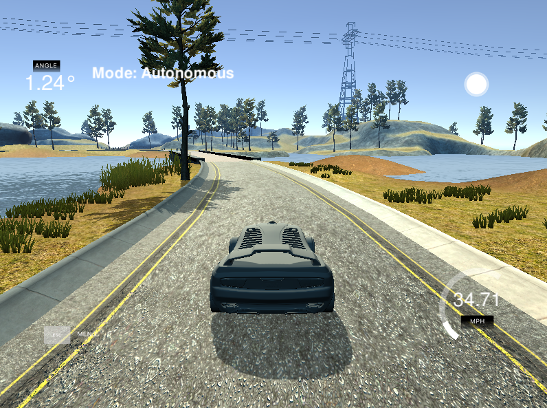

# CarND-Controls-PID
Self-Driving Car Engineer Nanodegree Program


[](http://www.udacity.com/drive)


---
## Overview
This is my implementation for the PID Controller project for the Udacity self driving course. 
This application connects to the Udacity simulator and controls the steering angle to minimize the cross track error (CTE), so the car stays on the track.

A PID Controller has three parameters:
 - Proportional - the main contribution in bringing the car back to the track
 - Integral - This compensates the wheel angle bias, if any
 - Derivative - It fixes the oscilations due to overshooting


   
## Implementation
The main challenge in this implementation was the twiddle algorithm.
Due to the asynchronos mechanism of simulator interface, the twiddle implementation had to follow a state full aproach.
This algorithm is implemented in a derived class of the PID class, so I could easily chose the PID behaviour at runtime. This also keeps the code smaller and more readable.

## Parameter tuning
My aproach for parameter tuning the parameters was to start with a stable enough configuration and then to use twiddle algorithm for fine tuning. I started with Sebastian Thrun course parameters and then I realized that (0.1, 0, 1) is a simple enough configuration that I can start playing with. Since the Ki parameter doesn't play a crucial role, I skipped it during my twiddle executions.
However, the results were not as smooth as I was expecting, so I tried also to run twiddle both in a deterministic mode (restart simulator at the beginning of each iteration) and in a free running mode. There is a noise which covers the measurement error for which I had to increase the measurement interval. This noise could be caused by the fact the simulator is very CPU intensive and it runs on the same machine with the application, competing on CPU resources.
I concluded that my expectations were biased because of my personal driving user experience, but the algorithm tries to minimize the CTE mean error and not the user experience.

## Dependencies

* cmake >= 3.5
 * All OSes: [click here for installation instructions](https://cmake.org/install/)
* make >= 4.1(mac, linux), 3.81(Windows)
  * Linux: make is installed by default on most Linux distros
  * Mac: [install Xcode command line tools to get make](https://developer.apple.com/xcode/features/)
  * Windows: [Click here for installation instructions](http://gnuwin32.sourceforge.net/packages/make.htm)
* gcc/g++ >= 5.4
  * Linux: gcc / g++ is installed by default on most Linux distros
  * Mac: same deal as make - [install Xcode command line tools]((https://developer.apple.com/xcode/features/)
  * Windows: recommend using [MinGW](http://www.mingw.org/)
* [uWebSockets](https://github.com/uWebSockets/uWebSockets)
  * Run either `./install-mac.sh` or `./install-ubuntu.sh`.
  * If you install from source, checkout to commit `e94b6e1`, i.e.
    ```
    git clone https://github.com/uWebSockets/uWebSockets 
    cd uWebSockets
    git checkout e94b6e1
    ```
    Some function signatures have changed in v0.14.x. See [this PR](https://github.com/udacity/CarND-MPC-Project/pull/3) for more details.
* Simulator. You can download these from the [project intro page](https://github.com/udacity/self-driving-car-sim/releases) in the classroom.


## Basic Build Instructions

1. Clone this repo.
2. Make a build directory: `mkdir build && cd build`
3. Compile: `cmake .. && make`
4. Run it: `./pid`. 

Tips for setting up your environment can be found [here](https://classroom.udacity.com/nanodegrees/nd013/parts/40f38239-66b6-46ec-ae68-03afd8a601c8/modules/0949fca6-b379-42af-a919-ee50aa304e6a/lessons/f758c44c-5e40-4e01-93b5-1a82aa4e044f/concepts/23d376c7-0195-4276-bdf0-e02f1f3c665d)

